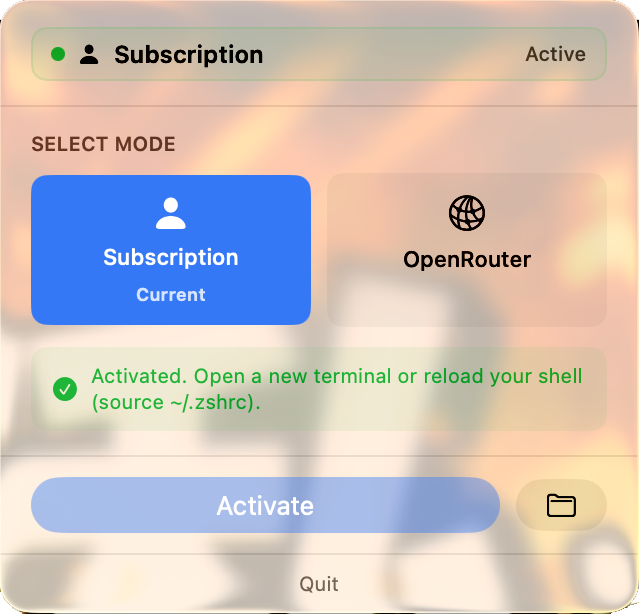
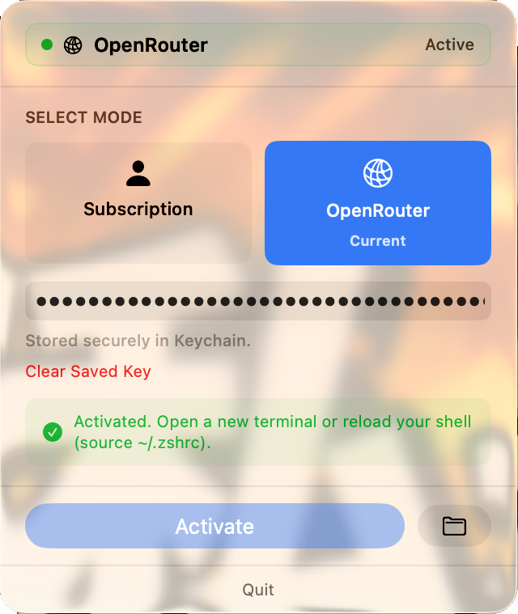
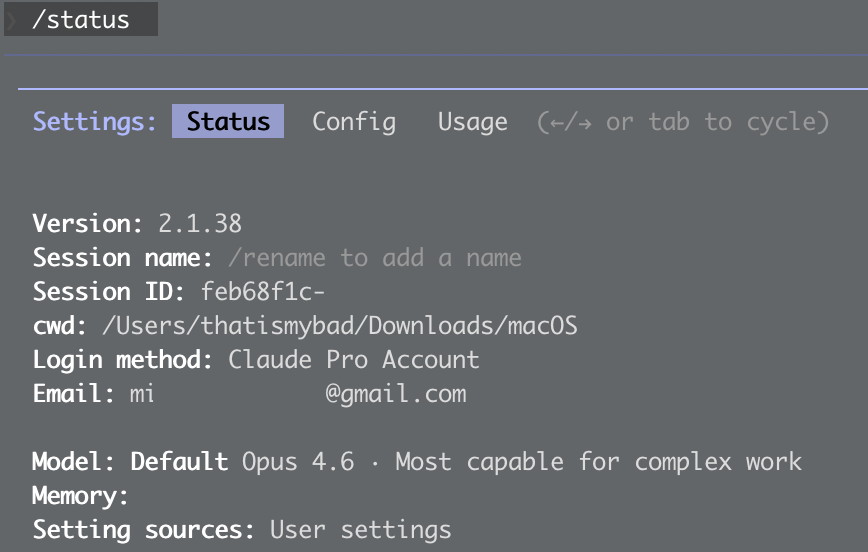
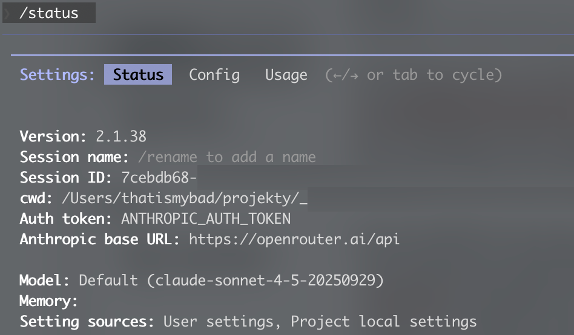

# Claude Provider Switcher

A simple macOS menu bar app to seamlessly switch between Claude Code subscription mode and OpenRouter API mode.


## Why This App?

Claude Code subscription has usage limits that reset monthly. When you hit your subscription limit, you can switch to OpenRouter API to continue coding without interruption. This app makes that switch effortless with a simple menu bar interface.

**Instead of manually editing shell config files**, this app:
- Toggles between subscription and OpenRouter modes with one click
- Securely stores your OpenRouter API key in macOS Keychain
- Updates the Claude Code provider configuration automatically
- Shows which mode is currently active in the menu bar

## Features

- 🔄 **One-click mode switching** — subscription ↔ OpenRouter
- 🔐 **Secure key storage** — API key saved in macOS Keychain
- 📊 **Visual status indicator** — see active mode at a glance
- 🎨 **Clean, native UI** — feels right at home on macOS

## Screenshots

### Subscription Mode


### OpenRouter Mode


### Verifying Active Mode

**Subscription Mode:**
When subscription is active, Claude Code shows your plan and account:



**OpenRouter Mode:**
When OpenRouter is active, Claude Code shows the OpenRouter base URL:



## Getting Started

### 1. Get an OpenRouter API Key

Visit [OpenRouter](https://openrouter.ai/) and create an account. Generate an API key from your dashboard.

For detailed integration instructions, see the [OpenRouter Claude Code Integration Guide](https://openrouter.ai/docs/guides/guides/claude-code-integration).

### 2. Install the App

Download the latest release and drag **Claude Provider Switcher.app** to your `/Applications` folder.

### 3. Launch and Configure

1. Click the menu bar icon (person or network symbol)
2. Select **OpenRouter** mode
3. Enter your OpenRouter API key
4. Click **Activate**

## Usage

### Switching Modes

1. Click the menu bar icon
2. Select your desired mode (Subscription or OpenRouter)
3. For OpenRouter, enter your API key if not already saved
4. Click **Activate**

### Applying Changes

**After activating a different mode:**

1. **Close and reopen your terminal** — The new environment variables need to be loaded
2. If switching doesn't work, **logout and login in Claude Code**:
   - Run `claude logout` in your terminal
   - Run `claude login` and follow the authentication flow

### Verifying Active Mode

Run `claude status` in your terminal:

- **Subscription mode**: Shows your Claude plan (Pro/Standard) and account email
- **OpenRouter mode**: Shows `Base URL: https://openrouter.ai/api`

## How It Works

The app manages `~/.config/claude-code/provider.zsh`, which is sourced by your shell to configure Claude Code's API endpoint.

**Subscription mode** (default):
```bash
# Unsets all API override variables
unset OPENROUTER_API_KEY
unset ANTHROPIC_AUTH_TOKEN
unset ANTHROPIC_BASE_URL
```

**OpenRouter mode**:
```bash
# Routes Claude Code through OpenRouter
export OPENROUTER_API_KEY="your-key"
export ANTHROPIC_BASE_URL="https://openrouter.ai/api"
export ANTHROPIC_AUTH_TOKEN="$OPENROUTER_API_KEY"
```

## Building from Source

### Requirements
- macOS 14.0 or later
- Xcode 15.0 or later

### Build
```bash
git clone https://github.com/yourusername/claude-provider-toggle.git
cd claude-provider-toggle
xcodebuild -scheme "Claude Provider Switcher" -configuration Release
```

The built app will be in `build/Build/Products/Release/`.

## License

**MIT License with Non-Commercial Clause**

Copyright (c) 2026 Michal Macinka

Permission is hereby granted, free of charge, to any person obtaining a copy of this software and associated documentation files (the "Software"), to use, copy, modify, merge, and distribute the Software for **non-commercial purposes only**, subject to the following conditions:

- The above copyright notice and this permission notice shall be included in all copies or substantial portions of the Software.
- **The Software may not be sold, sublicensed, or used for commercial purposes without explicit written permission from the copyright holder.**

THE SOFTWARE IS PROVIDED "AS IS", WITHOUT WARRANTY OF ANY KIND, EXPRESS OR IMPLIED, INCLUDING BUT NOT LIMITED TO THE WARRANTIES OF MERCHANTABILITY, FITNESS FOR A PARTICULAR PURPOSE AND NONINFRINGEMENT. IN NO EVENT SHALL THE AUTHORS OR COPYRIGHT HOLDERS BE LIABLE FOR ANY CLAIM, DAMAGES OR OTHER LIABILITY, WHETHER IN AN ACTION OF CONTRACT, TORT OR OTHERWISE, ARISING FROM, OUT OF OR IN CONNECTION WITH THE SOFTWARE OR THE USE OR OTHER DEALINGS IN THE SOFTWARE.

## Contributing

Contributions are welcome! Please feel free to submit issues or pull requests.

## Support

If you encounter any issues:
1. Check that `~/.config/claude-code/provider.zsh` exists and has correct permissions
2. Try logging out and back into Claude Code
3. Verify your OpenRouter API key is valid
4. Open an issue on GitHub with details

---

**Note**: This is an unofficial tool and is not affiliated with Anthropic or OpenRouter.
